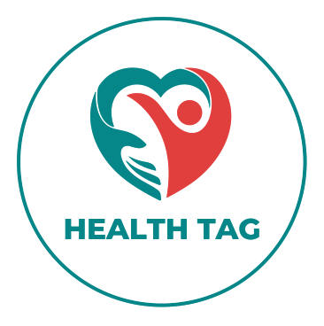

<p align="center">
  
</p>

A Health Tag é uma solução inovadora que propõe o uso de braceletes tecnológicos para armazenar informações vitais do usuário. Esses braceletes destacam-se por sua acessibilidade e completude de dados, armazenando informações como histórico médico, alergias e condições hereditárias. Além disso, fornecem a localização em tempo real do usuário, de extrema importancia em situações de emergência. 🏥👩‍⚕️🤍

Os braceletes da Health Tag apresentam uma série de benefícios, sendo eles:
- Agilidade no atendimento: as informações armazenadas nos braceletes estão disponíveis instantaneamente, reduzindo o tempo gasto em exames desnecessários e permitindo uma intervenção médica mais eficiente.
- Segurança: os braceletes permitem a identificação rápida e segura de indivíduos em situações de inconsciência, melhorando os serviços de resgate e segurança.
- Promoção da prevenção e cuidado proativo: os braceletes permitem que profissionais acessem dados em tempo real, facilitando a prevenção e gestão eficiente de condições médicas.

Em suma, a Health Tag é uma ferramenta prática e essencial para aprimorar a segurança e o cuidado com a saúde em grupos vulneráveis, especialmente em situações emergenciais.


# Integrantes do Grupo

#### Emanuelle Soares | rm 97973
#### Victória Pizza | rm 550609


# Executando o Projeto
**Siga os passos abaixo para executar o projeto em sua máquina local:**

1. Clone este repositório em sua máquina: 

    ``` git clone https://github.com/emnuelle/GS.git ```

2. Navegue até o diretório do projeto: 

    ```cd GS```

3. Instale as dependências: 

    ```npm install ou yarn install```


#  Iniciando o Projeto

Início Rápido com Concurrently

O Projeto Health Tag facilita o desenvolvimento ao utilizar a biblioteca Concurrently. Com essa ferramenta, é possível iniciar tanto o servidor local JSON quanto o projeto React com um único comando.

```npm run dev ```